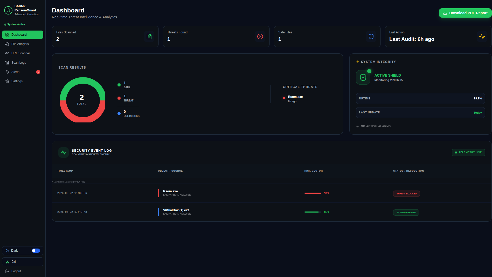
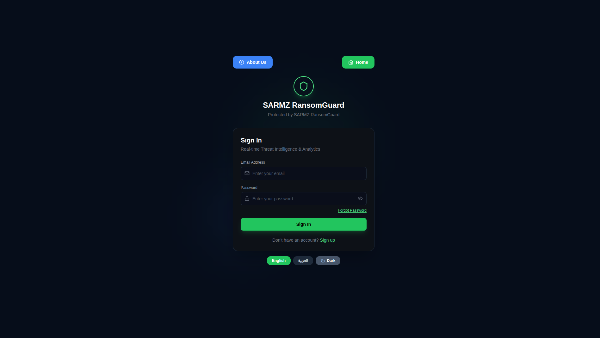
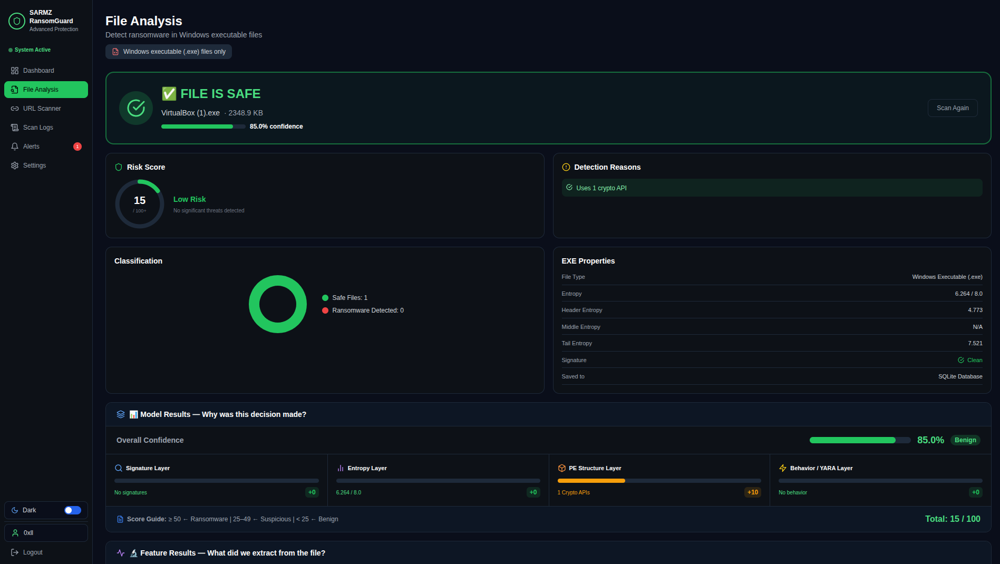
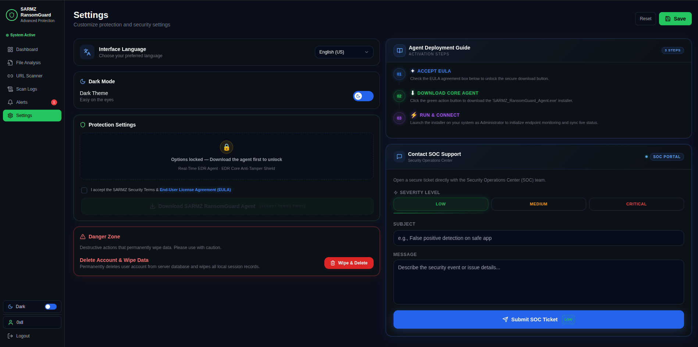
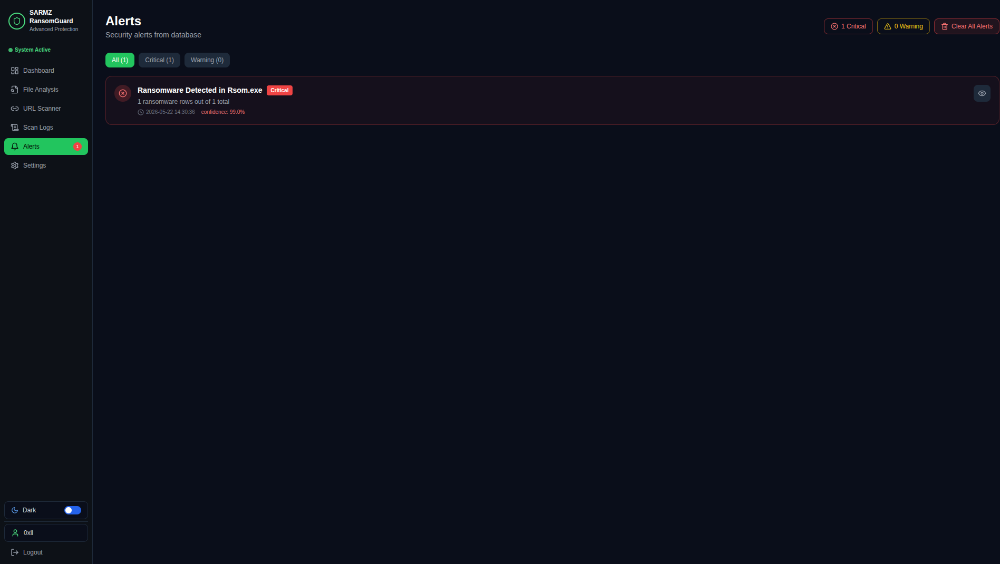
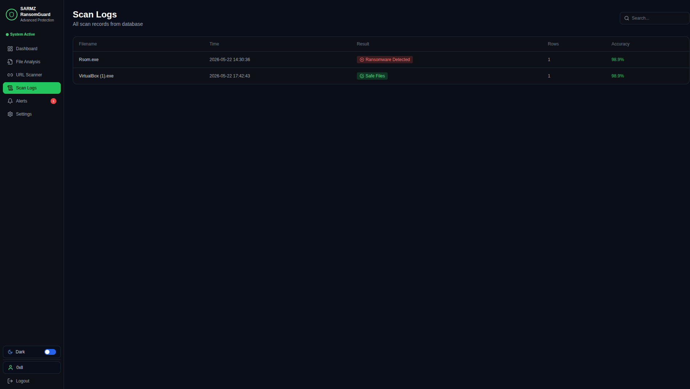
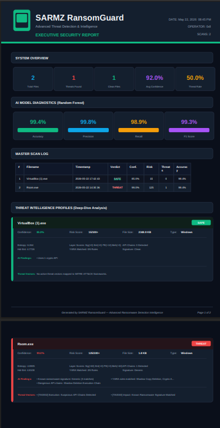
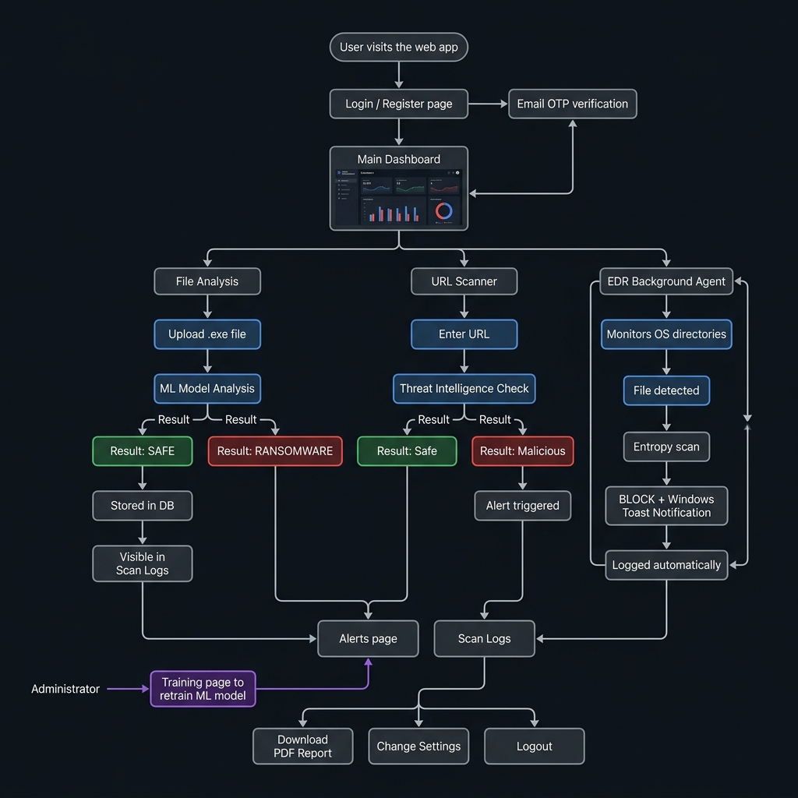
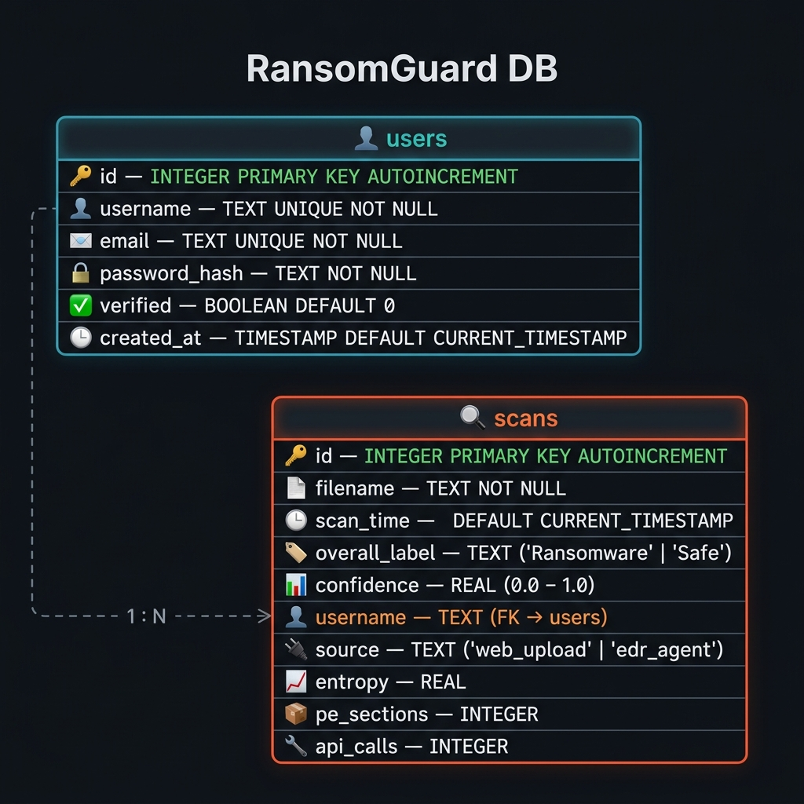

<div align="center">


<h1>🛡️ SARMZ RansomGuard</h1>

<p><strong>Next-Generation Ransomware Detection, Real-Time EDR Monitoring & ML-Powered Threat Intelligence</strong></p>

<p>
  
  
  
  
  
  
  
</p>

<p>
  
  
  
  
</p>

<br/>

> **SARMZ RansomGuard** is a full-stack, production-grade cybersecurity platform engineered to detect, analyze, and neutralize ransomware threats through advanced Machine Learning behavioral indicators and real-time Endpoint Detection & Response (EDR) monitoring.

<br/>

[🚀 Live Demo](https://ransomware-attack-detection-using.onrender.com) · [📖 Documentation](#-getting-started) · [🐛 Report Bug](https://github.com/x0ll/Ransomware-Attack-Detection-Using-Machine-Learning/issues) · [💡 Request Feature](https://github.com/x0ll/Ransomware-Attack-Detection-Using-Machine-Learning/issues)

</div>

---

## 📸 System Screenshots

### 🖥️ Dashboard

<div align="center">
  
  <br/><sub>Real-time threat metrics · Skeleton loading states · Scan distribution · System integrity · Live security event log</sub>
</div>

<br/>

### 🔐 Authentication & Threat Analysis

<div align="center">
  <table>
    <tr>
      <td align="center"><b>Sign In — Animated Cyber Radar</b><br/><br/><br/><sub>Animated Radar Canvas · Bilingual (EN/AR) toggle · Dark mode</sub></td>
      <td align="center"><b>File Analysis Engine</b><br/><br/><br/><sub>PE inspection · Precision Entropy scoring · Multi-layer ML results</sub></td>
    </tr>
  </table>
</div>

<br/>

### ⚙️ Settings — EDR, SOC Portal & Danger Zone

<div align="center">
  
  <br/><sub>
    <b>Agent Deployment Guide</b> (3-step activation) &nbsp;·&nbsp;
    <b>EDR Core Anti-Tamper Shield</b> &nbsp;·&nbsp;
    <b>Contact SOC Support Portal</b> (Severity levels: Low / Medium / Critical) &nbsp;·&nbsp;
    <b>Danger Zone</b> — Permanent account & data wipe
  </sub>
</div>

<br/>

### 🚨 Alerts & Scan Logs

<div align="center">
  <table>
    <tr>
      <td align="center"><b>Security Alerts</b><br/><br/><br/><sub>Critical/Warning classification · Instant visibility</sub></td>
      <td align="center"><b>Scan Logs</b><br/><br/><br/><sub>Full audit history · Color-coded results · Timestamps</sub></td>
    </tr>
  </table>
</div>

<br/>

### 📄 Executive PDF Report

<div align="center">
  
  <br/><sub>Auto-generated report with threat profiles, model diagnostics & MITRE ATT&amp;CK mappings</sub>
</div>

---

## 🔄 User Flow Diagram

<div align="center">
  
  <br/><sub>Complete user journey — from authentication through file/URL analysis, EDR monitoring, alerts, and PDF reporting</sub>
</div>

---

## 🌟 About The Project

**SARMZ RansomGuard** is an advanced cybersecurity framework built as a graduation project, combining the power of **Machine Learning** with **real-time Endpoint Detection and Response (EDR)** to provide multi-layered ransomware protection.

The system operates on two fronts simultaneously:
- **🌐 Web Interface**: An interactive React dashboard for on-demand file and URL threat analysis, scan history, and ML model management.
- **🤖 EDR Agent (`monitor.py`)**: A silent background sentinel that continuously watches OS directories, intercepts suspicious executables, and delivers instant threat notifications — all without user intervention.

---

## ✨ Core Features

<table>
  <tr>
    <td>🔍 <strong>Intelligent File Inspection</strong></td>
    <td>Deep binary analysis extracting entropy scores, PE headers, imported APIs, and section metadata, all mapped to a trained Random Forest classifier achieving <strong>98.9% accuracy</strong>.</td>
  </tr>
  <tr>
    <td>🌐 <strong>URL Threat Intelligence</strong></td>
    <td>Scan URLs for phishing, malware droppers, ransomware C2 servers, and domain reputation scoring in real time.</td>
  </tr>
  <tr>
    <td>👁️ <strong>Proactive EDR Agent</strong></td>
    <td>Non-blocking background sentinel monitoring critical OS directories (Downloads, Desktop, AppData) for suspicious executables using Watchdog filesystem events.</td>
  </tr>
  <tr>
    <td>🔒 <strong>EDR Anti-Tamper Shield</strong></td>
    <td>Prevents unauthorized termination of the security agent process. Toggle-activated from Settings after downloading the SARMZ Agent — ensures persistent EDR protection.</td>
  </tr>
  <tr>
    <td>🎫 <strong>SOC Ticket System</strong></td>
    <td>Built-in Security Operations Center support portal — users can open secure tickets directly from the Settings page. Tickets are delivered via styled HTML email to the SOC team instantly.</td>
  </tr>
  <tr>
    <td>🔔 <strong>Instant OS Notifications</strong></td>
    <td>Native Windows Toast notifications alert users upon detecting and blocking high-entropy or untrusted binaries in real time — zero latency, zero interference.</td>
  </tr>
  <tr>
    <td>📊 <strong>Interactive Analytics Dashboard</strong></td>
    <td>Live metrics showing total scans, threat distribution, detection rates, and ML performance (Accuracy, Precision, Recall, F1-Score) with skeleton loading states and beautiful interactive charts.</td>
  </tr>
  <tr>
    <td>📄 <strong>Executive PDF Reports</strong></td>
    <td>Auto-generated, professionally formatted PDF security reports with full threat intelligence profiles, model diagnostics, and MITRE ATT&CK framework mappings.</td>
  </tr>
  <tr>
    <td>🧠 <strong>Dynamic Model Retraining</strong></td>
    <td>Admin panel for uploading new behavioral datasets and retraining the Random Forest model on-the-fly without system downtime.</td>
  </tr>
  <tr>
    <td>🔐 <strong>Secure Authentication System</strong></td>
    <td>JWT token-based auth with user registration, email OTP verification, password reset flows, and granular Guest/Admin permission scoping. Account deletion supported.</td>
  </tr>
  <tr>
    <td>🌍 <strong>Full Bilingual Support</strong></td>
    <td>Complete Arabic/English UI localization with RTL layout switching and a dedicated language toggle directly on the Login screen.</td>
  </tr>
  <tr>
    <td>🌙 <strong>Dark / Light Theme</strong></td>
    <td>Premium dark and light modes with smooth animated transitions and persistent user preference across sessions.</td>
  </tr>
  <tr>
    <td>📡 <strong>Animated Cyber Radar</strong></td>
    <td>A fully custom-built radar canvas animation on the Login page — featuring sweep lines, neon glow, concentric rings, and live threat blips for an immersive cybersecurity experience.</td>
  </tr>
</table>

---

## 🏗️ System Architecture

```
SARMZ-RansomGuard/
│
├── 🖥️ frontend/                        React + Vite Client Application
│   ├── public/
│   │   └── favicon.svg                 ─ Custom neon shield SVG icon
│   ├── src/
│   │   ├── pages/                      Route-level UI Views
│   │   │   ├── Dashboard.tsx           ─ Live metrics, skeleton loading & chart analytics
│   │   │   ├── FileAnalysis.tsx        ─ Binary upload & precision ML classification
│   │   │   ├── UrlScanner.tsx          ─ URL threat intelligence scanner
│   │   │   ├── ScanLogs.tsx            ─ Historical audit log viewer
│   │   │   ├── Alerts.tsx              ─ Real-time threat alert feed
│   │   │   ├── Training.tsx            ─ Model retraining interface
│   │   │   ├── Settings.tsx            ─ Profile · EDR Anti-Tamper · SOC Ticket portal
│   │   │   ├── Login.tsx               ─ Animated radar canvas · Bilingual auth
│   │   │   └── About.tsx               ─ Team & project info
│   │   ├── components/
│   │   │   └── Sidebar.tsx             ─ Navigation & session state
│   │   └── lib/
│   │       ├── api-config.ts           ─ Dynamic API routing (localhost / Render)
│   │       ├── store.ts                ─ Global reactive state (Zustand)
│   │       └── language.ts             ─ i18n Arabic/English translations
│   └── index.html
│
├── ⚙️ backend/                         Python Flask Production Engine
│   ├── app/
│   │   ├── api_endpoints.py            ─ All REST API route handlers
│   │   ├── file_analyzer.py            ─ Core ML threat classification engine
│   │   ├── database.py                 ─ SQLite schema, CRUD & account deletion
│   │   ├── email_server.py             ─ SMTP OTP + SOC Ticket email system
│   │   └── server.py                   ─ Flask app factory & CORS config
│   ├── models/
│   │   └── random_forest_model.pkl     ─ Trained ML classifier (98.9% accuracy)
│   ├── datasets/                       ─ Behavioral malware training data
│   ├── monitor.py                      ─ EDR Background Agent & Toast daemon
│   └── requirements.txt               ─ Python dependency manifest
│
└── 📊 streamlit_app.py                 Interactive ML analytics dashboard
```

---

## 🧪 ML Model Performance

| Metric | Score |
|:---|:---:|
| ✅ Accuracy | **98.9%** |
| 🎯 Precision | **99.0%** |
| 🔁 Recall | **98.9%** |
| ⚖️ F1-Score | **98.9%** |
| 🌲 Algorithm | **Random Forest Classifier** |
| 📂 Training Samples | **62,000+ labeled binaries** |

---

## 🚀 Getting Started

### Prerequisites

| Requirement | Version |
|:---|:---|
| Node.js | `>= 18.0.0` |
| Python | `3.11.x` recommended |
| pip | Latest |
| OS (for EDR Agent) | Windows 10/11 |
| Admin Privileges | Required for EDR filesystem monitoring |

### 1️⃣ Clone the Repository

```bash
git clone https://github.com/x0ll/Ransomware-Attack-Detection-Using-Machine-Learning.git
cd Ransomware-Attack-Detection-Using-Machine-Learning
```

### 2️⃣ Backend Setup

```bash
cd backend

# Create and activate virtual environment (recommended)
python -m venv .venv
source .venv/bin/activate        # Linux/macOS
.venv\Scripts\activate           # Windows

# Install all dependencies
pip install -r requirements.txt

# Configure environment variables
cp .env.example .env
# Edit .env with your credentials
```

### 3️⃣ Launch the Backend API

```bash
cd backend
python run.py
```
> 🟢 API server starts on: `http://localhost:5000`

### 4️⃣ Launch the EDR Background Agent

Open a separate terminal and run the background monitor:

```bash
cd backend
python monitor.py
```
> 🛡️ The agent silently monitors your system directories for ransomware activity.

### 5️⃣ Launch the Frontend

```bash
cd frontend
npm install
npm run dev
```
> 🌐 Web client launches on: `http://localhost:5173`

---

## 🔗 API Reference

All authenticated endpoints require a valid Bearer token in the `Authorization` header.

| Endpoint | Method | Auth | Description |
|:---|:---:|:---:|:---|
| `/api/auth/register` | `POST` | ❌ | Create a new user account |
| `/api/auth/login` | `POST` | ❌ | Login and receive JWT token |
| `/api/auth/verify-otp` | `POST` | ❌ | Verify email OTP code |
| `/api/auth/reset-password` | `POST` | ❌ | Trigger password reset flow |
| `/api/auth/delete-account` | `POST` | ✅ | Permanently delete a user account |
| `/api/auth/submit-soc-ticket` | `POST` | ✅ | Submit a SOC support ticket via email |
| `/api/analyze` | `POST` | ✅ | Upload & analyze binary file for threats |
| `/api/scan-url` | `POST` | ✅ | Scan a URL for malicious indicators |
| `/api/scans` | `GET` | ✅ | Retrieve personal scan history |
| `/api/scans` | `DELETE` | ✅ | Clear scan history |
| `/api/dashboard/stats` | `GET` | ✅ | Fetch live dashboard metrics |
| `/api/model/retrain` | `POST` | ✅ Admin | Trigger ML model retraining |
| `/api/health` | `GET` | ❌ | Backend health check |

---

## 🗄️ Database Schema

<div align="center">
  
  <br/><sub>RansomGuard DB — Entity Relationship Diagram showing <code>users</code> and <code>scans</code> tables with a 1:N relationship</sub>
</div>

---

## 🛡️ Security Architecture

```
                    ┌─────────────────────────────────┐
                    │        SARMZ RansomGuard         │
                    │      Dual-Layer Defense           │
                    └─────────────────────────────────┘
                                    │
              ┌─────────────────────┼─────────────────────┐
              │                                           │
   ┌──────────▼──────────┐              ┌────────────▼────────────┐
   │   Web Interface      │              │    EDR Background Agent  │
   │  (User Triggered)    │              │  (Autonomous, Real-Time) │
   └──────────┬──────────┘              └────────────┬────────────┘
              │                                       │
   ┌──────────▼──────────┐              ┌────────────▼────────────┐
   │  File / URL Upload   │              │  Watchdog FS Events API  │
   └──────────┬──────────┘              └────────────┬────────────┘
              │                                       │
   ┌──────────▼──────────┐              ┌────────────▼────────────┐
   │  ML Classifier        │              │  Entropy + Heuristic    │
   │  (Random Forest)      │              │  Behavioral Analysis    │
   └──────────┬──────────┘              └────────────┬────────────┘
              │                                       │
   ┌──────────▼──────────┐              ┌────────────▼────────────┐
   │  Result → Dashboard  │              │  Anti-Tamper Shield      │
   └─────────────────────┘              │  BLOCK + OS Notification │
                                        └─────────────────────────┘
```

---

## 👨‍💻 Team

<div align="center">

|  |  |
|:---:|:---:|
| **Saud Al-Asmari** | **Abdulrahman Alfaifi** |
| [](https://github.com/x0ll) | [](https://github.com/JAxTeller8) |

</div>

---

## 🛡️ Security Disclaimer

> ⚠️ **This system is designed exclusively for academic research, malware behavior profiling, and engineering graduation showcase purposes.**
>
> Always test suspicious or untested executables within a **heavily isolated environment** such as a dedicated VirtualBox/VMware sandbox. Never execute unknown binaries on production or personal machines.

---

## 📄 License

This project is licensed under the **MIT License** — see the [LICENSE](LICENSE) file for details.

---

<div align="center">

**Built with ❤️ for Advanced Malware Detection & Endpoint Security Research**

⭐ Star this repository if you found it useful!

</div>